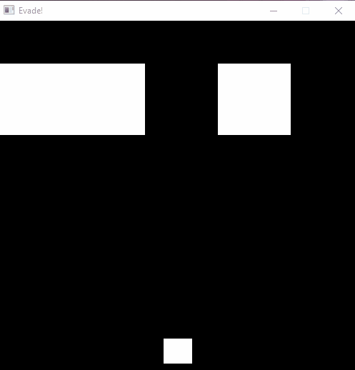

# Evade! - A game that fits entirely into 1 QR code

The goal of the project was to make a simple game whose entire binary fits into a single QR code. For this purpose we decided to make a simple windows based obstacle evading game, written in C.

This project was greatly inspired by this MattKC video: https://www.youtube.com/watch?v=ExwqNreocpg&t=628s



### Limitations

Largest possible binary data that fits into the biggest QR code is 2,953. So that was our limitations - entire game binary must be less than 2953 bites.

Because of the size limitation, the game was written in C, with the Win32 API.

Seeing how we managed to get the binary size only to cca 6KB, we used the [Crinkler](https://github.com/runestubbe/Crinkler) tool for compressing the game to the wanted size.

## HowTo

1. **Download the source files**
 
   To try the game - go to the /game folder and run:

   ```
   run.bat
   ```
 
 
 ## Future work
 Stuff that would be cool to add to the game.
 
 [] Movement smoothness for the player and the obstacles.
 
 [] Power up system.
 
 [] Better code...
 
